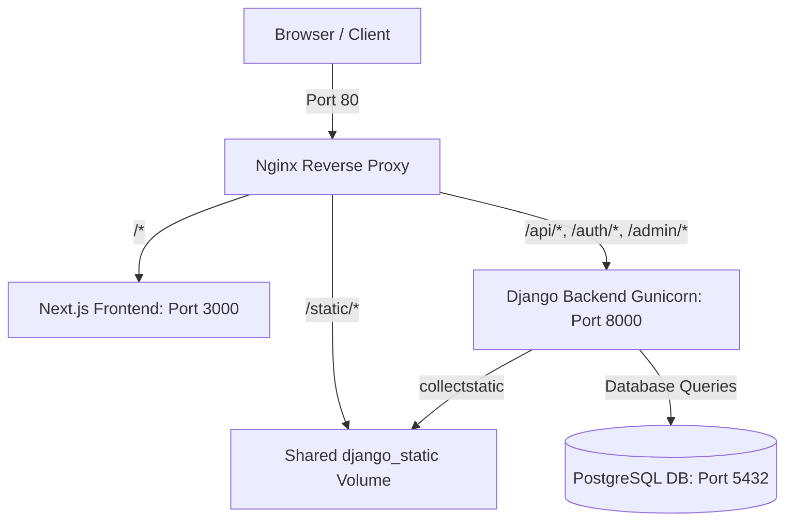

# 🚀 Sessions Marketplace

Sessions Marketplace is a premium full-stack containerized mentoring platform. It enables client users to find, book, and schedule 1-on-1 coaching sessions with elite creators, and allows creators to list mentoring offers, track earnings statistics, and accept/cancel incoming client reservations.

Built with **Next.js 16 (React 19 & Tailwind CSS v4)**, **Django 5.1 & Django REST Framework**, **PostgreSQL 16**, and orchestrated through an **Nginx Reverse Proxy**.

---

## 📐 Architecture & Request Flow



---

## 🛠️ Tech Stack
*   **Core Logic**: Next.js 16 (App Router), React 19, Axios, TanStack React Query v5.
*   **Styling**: Tailwind CSS v4 (Modern dark mode dashboard system).
*   **Backend Server**: Django 5.1, Gunicorn WSGI.
*   **API Framework**: Django REST Framework, Django-Allauth (SimpleJWT).
*   **Database**: PostgreSQL 16.
*   **Routing & Proxying**: Nginx (Active reverse proxy).

---

## 🚀 Setup Steps

### 1. Configure Environment Variables
Copy the template environment configuration file into a local `.env` file:
```bash
cp .env.example .env
```

### 2. Boot Services
Run Docker Compose to build, create volumes, and launch the healthy services stack in the background:
```bash
docker compose up --build -d
```

### 3. Seed Mock Data
Inject mock creators, clients, and session listings (e.g. Yoga, Django Backend, System Design) for testing:
```bash
docker compose exec backend python manage.py seed_data
```
You can now access the catalog at **`http://localhost`**.

---

## 🐳 Useful Docker Commands

| Action | Command |
| :--- | :--- |
| **Start Services** | `docker compose up -d` |
| **Rebuild Containers** | `docker compose up --build -d` |
| **Stop Stack** | `docker compose down` |
| **View logs** | `docker compose logs -f` |
| **Check service health** | `docker compose ps` |
| **Run Backend tests** | `docker compose exec backend python manage.py test` |
| **Django Shell** | `docker compose exec backend python manage.py shell` |

---

## 🔑 Google OAuth Sandbox Bypass

To simplify developer testing without configuring active Google API Console client credentials, the backend includes an authentication override:

1.  Click **Sign In** on the catalog header or click **Sign In to Book Session** on `/session/[id]`.
2.  Click **Sign In with Google (Dev Override)**.
3.  Axios automatically transmits `mock-google-token` to the server. The backend bypasses the Google check, registers/retrieves a mock account (`google.user@example.com` with role `USER`), and issues a valid JWT access/refresh token.
4.  To test as a **Creator**, register a new account through the **Create Account** tab and select the **Creator (Mentor)** role. Alternatively, you can swap roles dynamically on the `/profile` settings page.

---

## 📄 API Documentation

All API routes are prefixed by Nginx to the backend container.

| Endpoint | Method | Auth Required | Description |
| :--- | :--- | :---: | :--- |
| `/api/sessions/` | `GET` | No | Lists all paginated sessions (public). |
| `/api/sessions/` | `POST` | Yes (Creator) | Creates a new session offer. |
| `/api/sessions/<id>/` | `GET` | No | Retrieves detailed information of a session. |
| `/api/profile/` | `GET` | Yes | Retrieves current user profile metadata. |
| `/api/users/<id>/` | `PATCH` | Yes | Updates profile details (Name, Avatar, Workspace Role). |
| `/bookings` | `POST` | Yes (User) | Places a session reservation request (duplicates/self-booking blocked). |
| `/bookings/<id>/` | `PATCH` | Yes | Cancels or confirms a booking status. |
| `/bookings/my` | `GET` | Yes (User) | Lists all bookings placed by the authenticated client. |
| `/creator/bookings` | `GET` | Yes (Creator) | Lists all bookings requested on sessions hosted by the creator. |
| `/auth/login` | `POST` | No | SimpleJWT email credential login. |
| `/auth/register` | `POST` | No | Creates a new User/Creator account. |

---

## 💻 Demo Verification Flow

For a full interactive checkout verification, perform the following steps:

1.  **Seeker Session Booking**:
    *   Sign in as a User (e.g. email: `bob.user@example.com` / password: `password123`).
    *   Go to a session page (e.g. `http://localhost/session/1`), click **Book Session Now**, and watch it register in **Active Bookings** table on `/dashboard/user`.
2.  **Role Toggling (Profile Settings)**:
    *   Navigate to `/profile` (dropdown top right).
    *   Change the **Sandbox Workspace Role** to **Creator (Mentor)** and save.
    *   The navbar changes to display **Creator Space**.
3.  **Offer Listing & Approval Metrics**:
    *   Navigate to `/dashboard/creator`.
    *   Add a new Session listing and see it reflect in the hosted sessions table and home catalog.
    *   Click **Approve** on the client request and watch **Total Revenue** update.

---

## 📸 Screenshots

*The following screenshots illustrate the responsive UI workflows:*

### 1. Landing Catalog (Guest View)
```
[Insert Screenshot: Landing Page / Catalog Grid]
```

### 2. Session Booking details page
```
[Insert Screenshot: /session/[id] Details page]
```

### 3. User Dashboard (Active / Past reservation splits)
```
[Insert Screenshot: User dashboard tables split]
```

### 4. Creator Analytics Dashboard
```
[Insert Screenshot: Creator dashboard KPI counts & sessions table]
```
